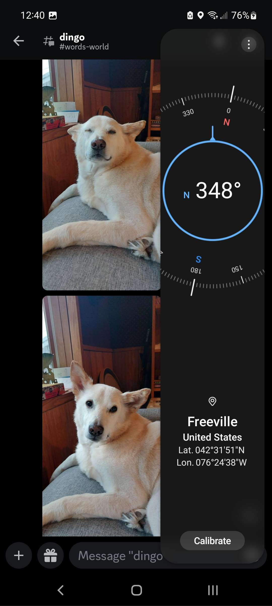
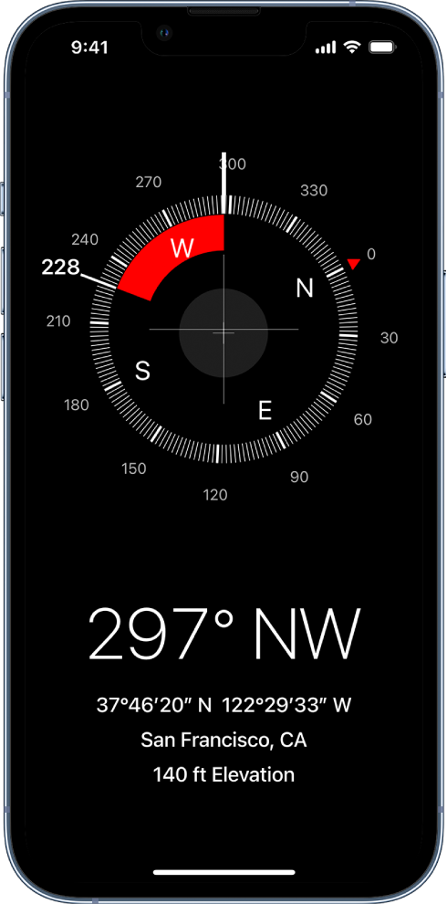
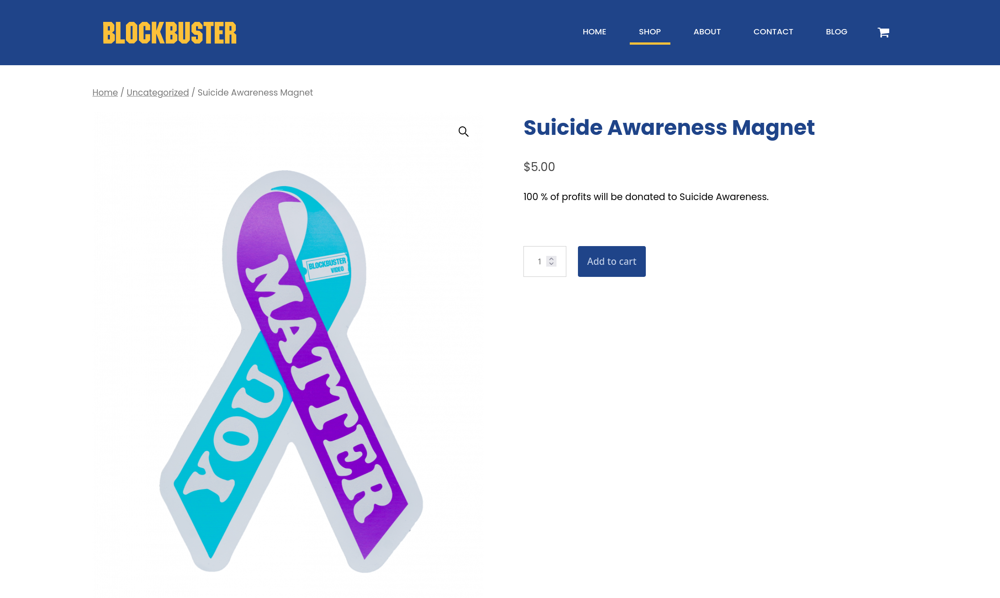

# <!--fit--> Blockbuster Compass

Make it a Blockbuster hike

---
# <!--fit--> Features
---
### Basics

- Blockbuster-branded compass 
- Same essentials as iPhone/Samsung compasses
---
### Blockbuster Standard Location System
- Coordinate display with Normal coordinate readouts (Lat/Lon) alongside extra system that is 0'd on Blockbuster

- Make it inconspicuous, blend it in
---
## Route via Maps

- A button to route to the store that then opens Google/Apple maps to the right location

- This allows us to skip integrating maps into the app ourselves, while still being pretty elegant and giving us a neat feature
---
# <!---fit---> Technology
---
# [Xamarin](https://dotnet.microsoft.com/en-us/apps/xamarin)
* Microsoft-developed app Platform for building & Deploying apps to iPhone, Android and more

* Primary language is C#

* Has built-in compass support

---
## Technology cont.
- We will have to use Visual Studio (not VS Code!)
- I'll probably have to do some simple but funky math to translate normal coordinates to BSLS
---

## Next Steps
- Install [Xamarin](https://learn.microsoft.com/en-us/xamarin/get-started/installation/?pivots=windows-vs2022)
- Watch some [Xamarin Tutorials](https://www.youtube.com/watch?v=-LL54r2zqZM&list=PLAt44-Gu2dzyw0YZMe75S1BNKNFU-2i3u)
- Watch some [Blockbuster Ads](https://www.youtube.com/watch?v=EmH3lHKBboo)
- Maybe watch the [Documentary](https://en.wikipedia.org/wiki/The_Last_Blockbuster)?

---
